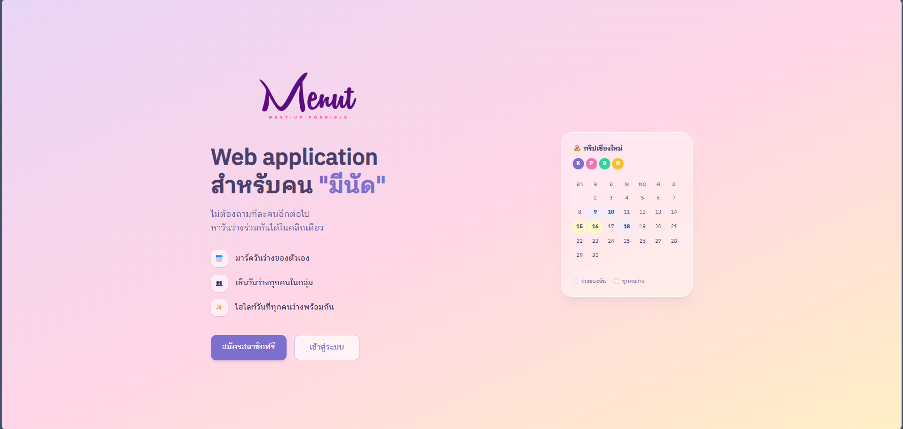
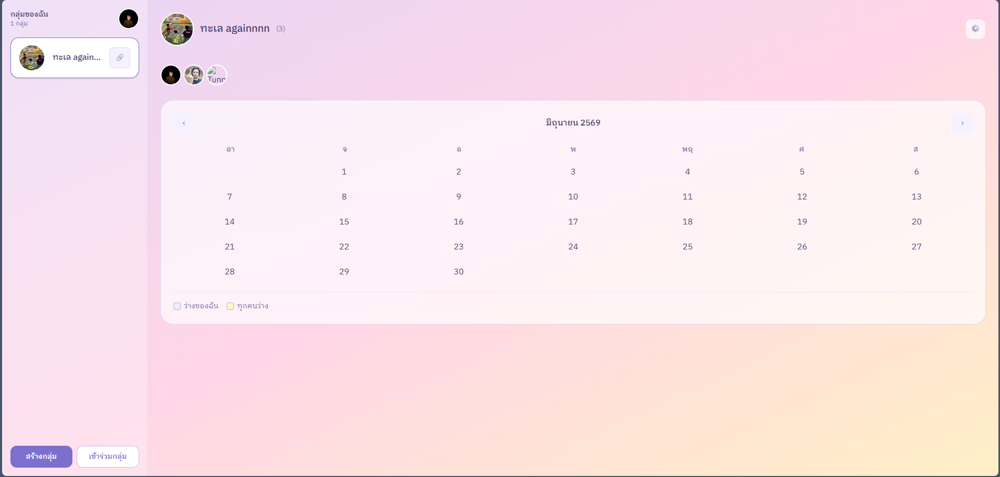
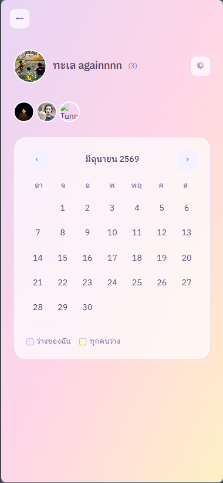

# Menut — Meet-up Possible

> Web application สำหรับคน **"มีนัด"**

Menut ช่วยให้กลุ่มเพื่อนหาวันว่างร่วมกันได้ง่ายขึ้น ไม่ต้องถามทีละคนอีกต่อไป

🌐 **Live Demo:** [menut.vercel.app](https://menut.vercel.app)

---

## Screenshots

### Landing Page


### Groups & Calendar (Desktop)


### Calendar (Mobile)


---

## Features

- 📅 **มาร์ควันว่าง** — กดเลือกวันที่ตัวเองว่างได้เลย
- 👥 **เห็นวันว่างทุกคน** — ดูได้ว่าใครว่างวันไหนบ้างในกลุ่ม
- ✨ **ไฮไลท์วันที่ทุกคนว่างพร้อมกัน** — เห็นทันทีว่านัดได้วันไหน
- 🔗 **Invite Code** — เชิญเพื่อนเข้ากลุ่มด้วย code
- 📱 **Responsive** — ใช้งานได้ทั้ง mobile และ desktop

---

## Tech Stack

### Frontend
- **Next.js 15** — React framework with App Router
- **Tailwind CSS v4** — Utility-first CSS
- **Supabase Storage** — อัปโหลดรูปภาพ

### Backend
- **Node.js + Express** — REST API
- **Prisma ORM** — Database ORM
- **PostgreSQL** — Database (via Supabase)
- **JWT** — Authentication
- **bcrypt** — Password hashing

### Infrastructure
- **Vercel** — Frontend hosting
- **Render** — Backend hosting
- **Supabase** — Database & Storage

---

## How to Run Locally

### Prerequisites
- Node.js 18+
- PostgreSQL

### Backend
```bash
cd menut-backend
npm install
cp .env.example .env   # แก้ไข DATABASE_URL และ JWT_SECRET
npx prisma migrate dev
node index.js
```

### Frontend
```bash
cd menut-frontend
npm install
cp .env.example .env.local   # แก้ไข NEXT_PUBLIC_API_URL และ Supabase keys
npm run dev
```

---

## Environment Variables

### Backend (.env)
```
DATABASE_URL=
JWT_SECRET=
```

### Frontend (.env.local)
```
NEXT_PUBLIC_API_URL=
NEXT_PUBLIC_SUPABASE_URL=
NEXT_PUBLIC_SUPABASE_ANON_KEY=
```

---

## Author

**Kanchai Lerdsrisakulrat**  
First jobber — aspiring fullstack engineer 🚀
